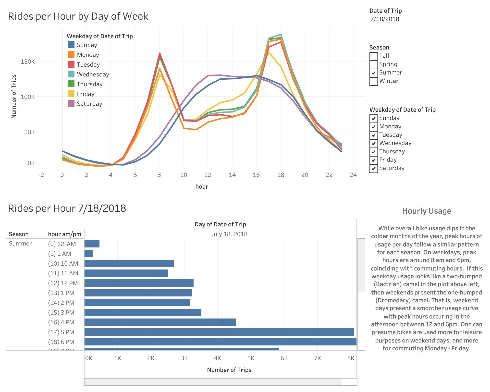
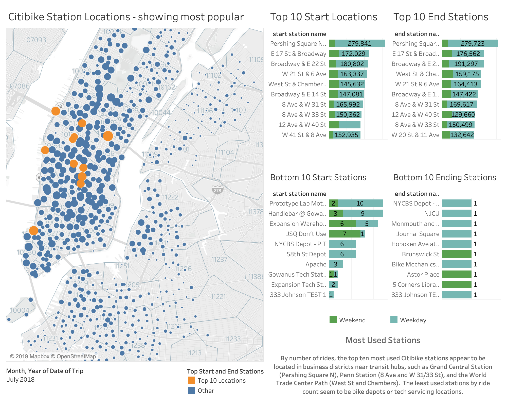
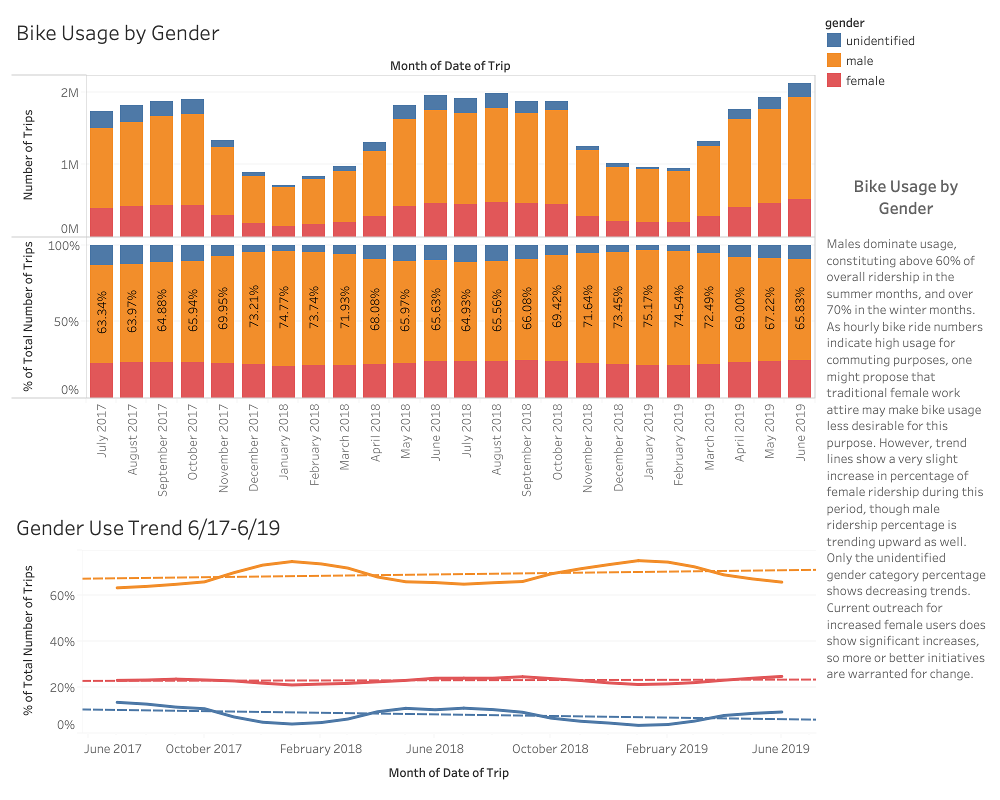
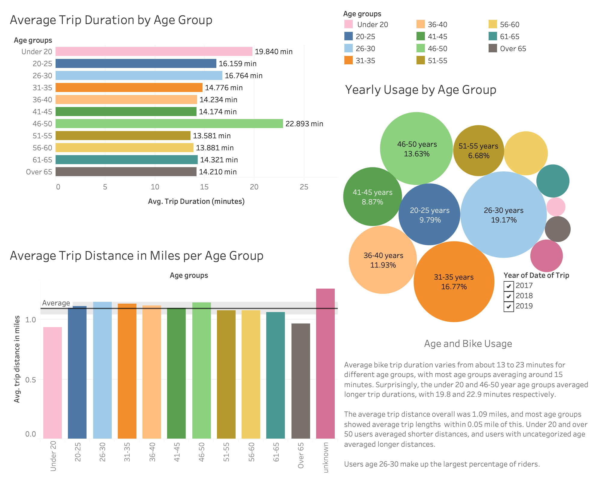
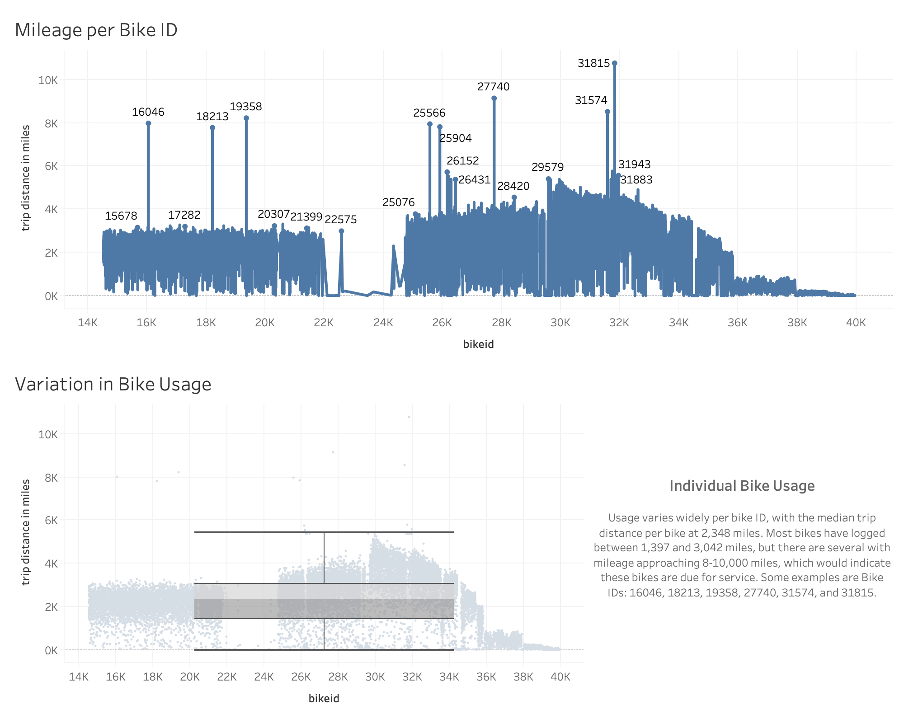
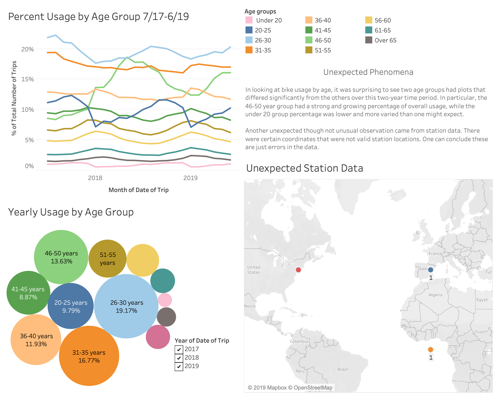

# Citi Bike Analytics

## Background

Citi Bike trip data was downloaded from the [Citi Bike Data](https://www.citibikenyc.com/system-data) webpage for the months from July 2017 to June 2019 (201707-citibike-tripdata.csv.zip to 201906-citibike-tripdata.csv.zip). Trip origin, destination, duration, date and time, user gender and birth year, and bike ID information included in these files were studied to produce the following observations.

---

## Ridership Growth from July 2017 to June 2019

Overall number of bike rides has increased, with over 1.7 million bike trips logged in June 2019. Ridership has increased in each of the last four quarters (Q3 2018 to Q2 2019) compared to the same quarters in the prior year, with the largest percentage increase of 27.58% growth between Q1 of 2018 and Q1 of 2019.

The large majority of riders (>80%) continues to be annual subscribers, though the percentage of short-term customers has shown a very slight increasing trend over the last two years.

---

## Hourly Usage

Peak hours of bike usage are @ 8 am and 5-6 pm on weekdays, a pattern that is consistent through all seasons, though overall usage dips in the colder months of the year. Weekend days show a smoother usage curve, with peak hours between 12 and 5 pm, a pattern that also remains throughout the seasons. This indicates significant bike usage for commuting purposes during weekdays, while there may be a greater share of recreational usage on weekends.

---

## Top Stations

By number of rides, the top ten most used Citi Bike stations appear to be located in business districts near transit hubs, such as Grand Central Station (Pershing Square N), the Penn Station (8th Ave and W 31/33), and the World Trade Center Path (West St and Chambers). The least used stations by ride count seem to be bike depots or tech servicing locations.

---

## Gender Breakdown

Males dominate usage, constituting above 60% of overall ridership in the summer months, and over 70% in the winter months. As hourly bike ride numbers indicate high usage for commuting purposes, one might propose that traditional female work attire may make commuting by bike less appealing. Trend lines do show a very slight increase in percentage of female ridership between 7/17 and 6/19, though male ridership percentage is trending upward as well. Only the unidentified gender category shows a decreasing usage trend. Current outreach to female users does not show significant impact on percent of female users. Therefore more or better outreach initiatives are warranted to effect an increase of female user share.

---

## Age Breakdown

Average bike trip duration varies from about 13 to 23 minutes for different age groups, with most age groups averaging near 15 minutes. Riders 30 years old and under show a longer average ride length (16.16 - 19.84 minutes), and the age group 46-50 shows a jump in average ride length to 22.89 minutes.

The average bike trip distance for all users was 1.09 miles, and most age groups showed average trip distances within within 0.05 miles of this. Users under 20 and users over 50 averaged shorter ride distances, and users of unknown age averaged longer distances.

Users age 26-30 had the largest usage share (19.17% over the entire data period) with users 31-35 years next (16.77% of all ridership).

---

## Bike Stats

Usage varies widely per bike ID, with a median bike mileage of 2,348 miles. Most bikes have logged between 1,397 and 3,042 miles, but there are several with mileage approaching 8,000-10,000 miles, which would indicate these bikes are due for service. Some examples are bike IDs: 16046, 18213, 19358, 27740, 31574, and 31815.

---

**Unexpected Phenomena:**

* In looking at bike usage per age group, it was surprising to see two age groups had plot profiles that differed significantly from the others between July 2017 and June 2019. In particular, the 46-50 year group had a strong and growing share of overall usage, while the under 20 group percentage was lower and fluctuated more than one might expect.

* Also, in plotting station location, certain coordinates turned up in other parts of the world. These can be attributed to errors in data entry of geographical cooordinates.

